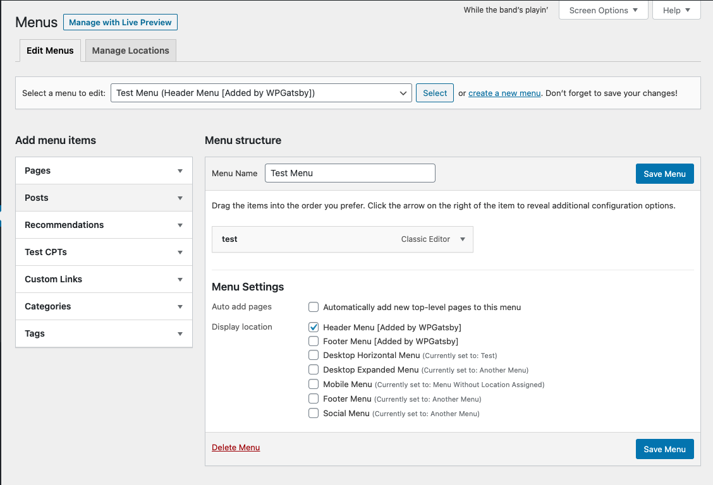
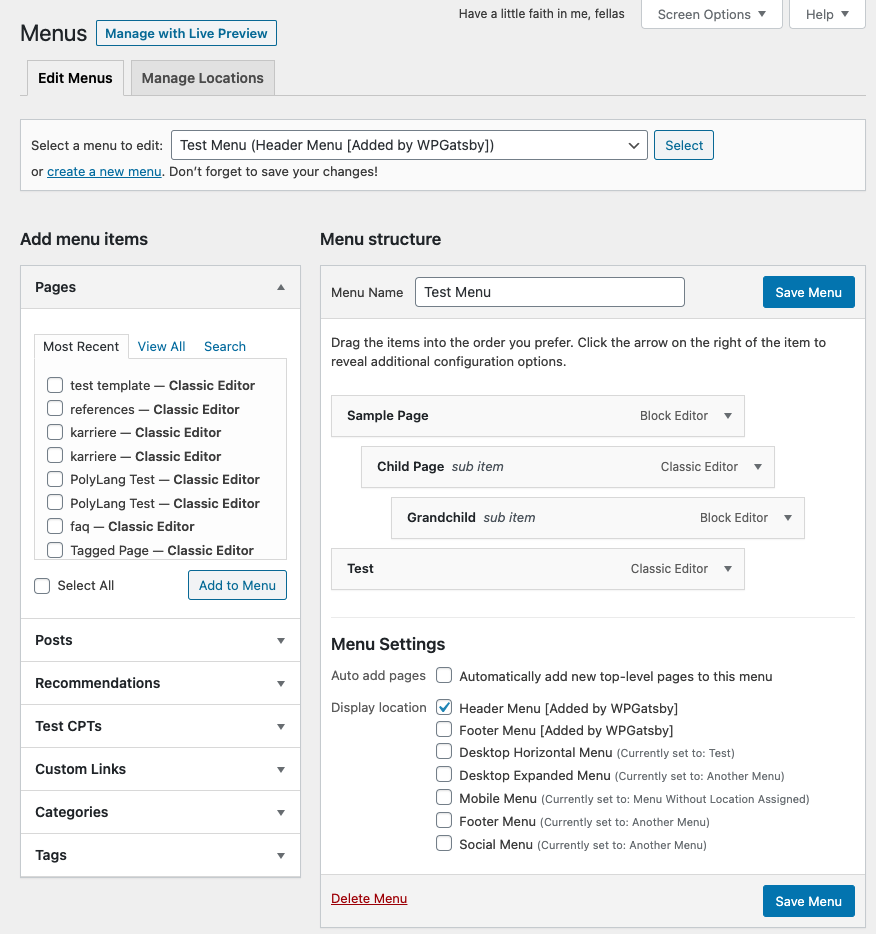
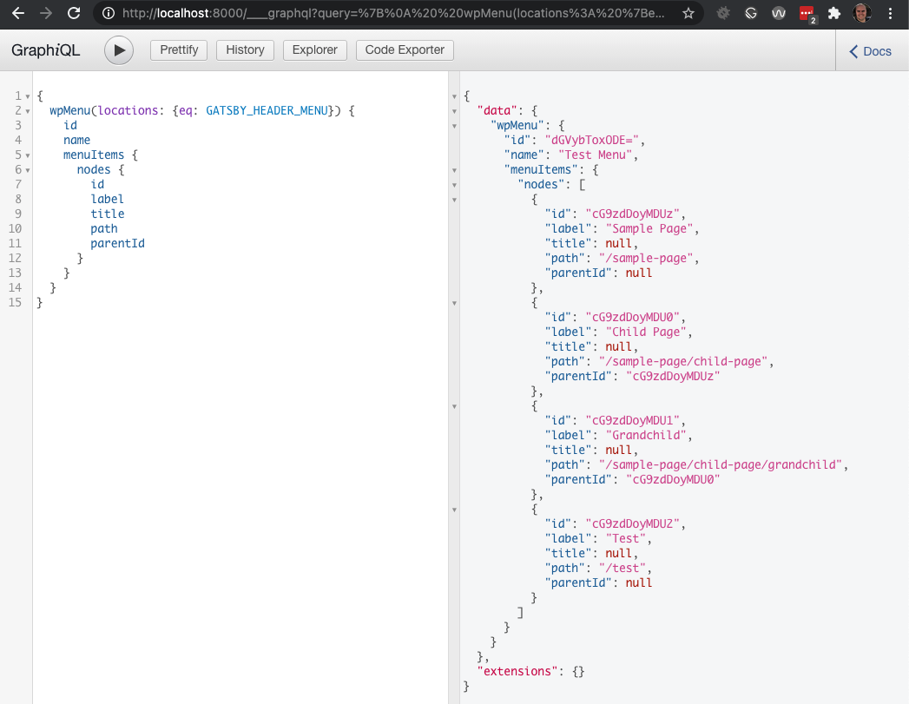
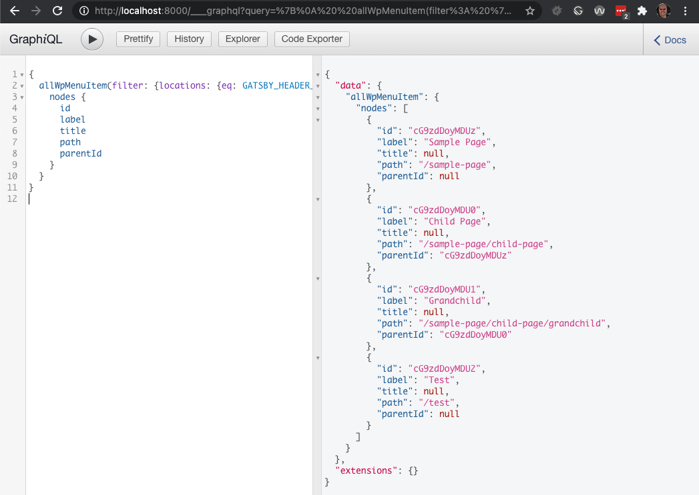

**This page has moved to the [Gatsby monorepo!](https://github.com/gatsbyjs/gatsby/tree/master/packages/gatsby-source-wordpress/docs/tutorials/using-wordpress-menus.md)**

Hi there! 👋 thank you so much for being a beta/alpha tester of this plugin!
You've helped us bring a much more stable WordPress integration to Gatsby and we're very thankful for that!

We've shipped this plugin as `gatsby-source-wordpress@4.0.0`.
`gatsby-source-wordpress-experimental` is now deprecated.
Please upgrade by npm/yarn installing the latest version of the stable plugin and updating your gatsby-config.js to include the stable plugin name.

We've chosen this point to release this plugin as a stable release not because there are no bugs (all software has some bugs), but because this plugin is far more stable than the last major version of `gatsby-source-wordpress`.

Note that we will continue fixing Github issues you've opened in the -experimental repo - those are not forgotten and will be transferred to the Gatsby monorepo.

Thank you! 💜

# Using WordPress Nav Menus with Gatsby

This tutorial assumes that you already have a [Gatsby site running](https://github.com/gatsbyjs/gatsby-source-wordpress-experimental/blob/master/docs/getting-started.md)
with Gatsby Source WordPress active and pointing at a WordPress site's GraphQL endpoint powered
by [WPGraphQL](https://wordpress.org/plugins/wp-graphql/). You should also be familiar with [how to
query WordPress data](./querying-data.md) with Gatsby.

In this tutorial we will cover how you can use WordPress Nav Menus in your Gatsby site.

- Overview of WordPress Nav Menus
  - Activating the Nav Menu Manager
  - Creating a Menu
- Menus and Menu Items in WPGraphQL
- Querying Menus and Menu Items in Gatsby
  - Working with Hierarchcial Data

## Overview of WordPress Nav Menus

WordPress has a Nav Menu Manager that provides a drag and drop interface to manage nav menus and
Nav Menu Items (links to internal or external web pages).

### Activating the Nav Menu Manager

By default, WordPress leaves the Nav Menu Manager disabled in the WordPress Admin. In order to use
the Nav Menu Manager in WordPress, at least one menu location must be registered to the site.

You can activate menus with code, or with the WPGatsby plugin, or a combination of both.

#### Activating Nav Menu Manager with WPGatsby

When the [WPGatsby](https://wordpress.org/plugins/wp-gatsby/) plugin is active, it registers 2 Nav
Menu locations, which activates the WordPress Nav Menu Manager.

The menu locations added by WPGatsby are as follows:

- "Header Menu [Added by WPGatsby]"
- "Footer Menu [Added by WPGatsby]"


You can optionally turn this off from the WPGatsby Settings (Settings > GatsbyJS) page, if you
prefer to not have these Menu Locations registered by WPGatsby.


#### Activating Nav Menu Manager with Code

In order to activate the WordPress Nav Menu Manager with code, you need to register a Nav Menu
location using the `register_nav_menus` function. You can read more about this in the
[WordPress Codex](https://developer.wordpress.org/reference/functions/register_nav_menu/).

### Creating a Nav Menu in WordPress

Once you have the WordPress Nav Menu manager active, you can visit the Nav Menu Manager in your
WordPress dashboard under Appearance > Menus.

The user interface looks like the following:



This UI allows for internal content, or custom links to be added to a Nav Menu as Menu Items, and
allows for Menus to be assigned to a registered Menu Location.

## Menus and Menu Items in WPGraphQL

Menus (and their menu items) that are not assigned a Menu Location are not considered publicly
accessible entities, and are not publicly exposed in WPGraphQL. In order to use menus with Gatsby,
you must assign the menu to a location.

When creating a Menu, there's a checkbox setting titled "Display Location" with a list of available
Nav Menu locations. You must select at least one location when saving the menu for it to be publicly
exposed and available in Gatsby.

## Querying Menus and Menu Items in Gatsby

WordPress Nav Menus consist of 2 primary components: Menus and Menu Items.

Menu Items are the individual items (links to pages), and the Menu is the entity that groups the
Menu Items together.

Menu Items are typically the most relevant part of menus, as that's what users interact with on your
site.

You can query Menu Items directly, or you can query a Menu, and the connected Menu Items.

For the examples below, we have a Nav Menu named "Header Menu" assigned to the menu location
"Header Menu [Added by WPGatsby]". The menu has 4 Menu Items configured showcasing hierarchical menu
item relationships.

If you have different Menu / Menu Location names, adjust your queries accordingly.



Let's take a look at some example queries:

### Query a Menu by Location and it's MenuItems

The following query is a Query against Gatsby's GraphQL API for a specific Menu filtered by location,
and its connected Menu Items.

```graphql
{
  wpMenu(locations: { eq: GATSBY_HEADER_MENU }) {
    id
    name
    menuItems {
      nodes {
        id
        label
        title
        path
        parentId
      }
    }
  }
}
```

Here's a screenshot of the query using Gatsby's GraphiQL tool:



As shown in the image, the "Test Menu" that is assigned to the location "Header Menu
[Added by WPGatsby]" is returned, and the 4 Menu Items that were added to the menu are returned with
the fields we requested.

### Query MenuItems by Location

The following query is a Query against Gatsby's GraphQL API for Menu Items filtered by location,
skipping the Menu altogether.

```graphql
{
  allWpMenuItem(filter: { locations: { eq: GATSBY_HEADER_MENU } }) {
    nodes {
      id
      label
      title
      path
      parentId
    }
  }
}
```



As shown in the image, the Menu Items that belong to the "Test Menu" assigned to the location "Header
Menu [Added by WPGatsby]" are returned, skipping any information about the Menu itself being returned,
as it wasn't asked for.

## Working with Hierarchical Data

One thing you might have noticed, is that even though the Menu Items were configured to be
hierarchical (parent/child/grandchild) the Menu Items in both example queries were returned in a
flat list (parent/child/grandchild all at the same level).

There's a good chance you will want to convert the flat-list back into a hierarchical list to use in
your UI components.

To do this, we can use a function like the following:

```javascript
const flatListToHierarchical = (
  data = [],
  { idKey = "key", parentKey = "parentId", childrenKey = "children" } = {}
) => {
  const tree = []
  const childrenOf = {}
  data.forEach((item) => {
    const newItem = { ...item }
    const { [idKey]: id, [parentKey]: parentId = 0 } = newItem
    childrenOf[id] = childrenOf[id] || []
    newItem[childrenKey] = childrenOf[id]
    parentId
      ? (childrenOf[parentId] = childrenOf[parentId] || []).push(newItem)
      : tree.push(newItem)
  })
  return tree
}
```

This function takes a list of objects and converts it to a hierarchical list based on the objects
parentId.

This could be used like so:

```javascript
$hierarchicalList = flatListToHierarchical(data.allWpMenuItem.nodes)
```

And we would end up with a list like the following, which matches the hierarchical structure:

```json
[
  {
    "id": "cG9zdDoyMDUz",
    "label": "Sample Page",
    "title": null,
    "path": "/sample-page",
    "parentId": null,
    "children": [
      {
        "id": "cG9zdDoyMDU0",
        "label": "Child Page",
        "title": null,
        "path": "/sample-page/child-page",
        "parentId": "cG9zdDoyMDUz",
        "children": [
          {
            "id": "cG9zdDoyMDU1",
            "label": "Grandchild",
            "title": null,
            "path": "/sample-page/child-page/grandchild",
            "parentId": "cG9zdDoyMDU0"
          }
        ]
      }
    ]
  },
  {
    "id": "cG9zdDoyMDU2",
    "label": "Test",
    "title": null,
    "path": "/test",
    "parentId": null
  }
]
```
